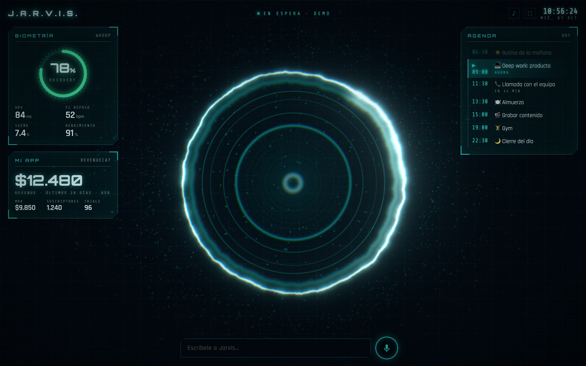

# J.A.R.V.I.S.

**Estaba chato de mi desorden, así que me construí a JARVIS.**

Es mi asistente personal. Por dentro es **Claude Code corriendo dentro de mi segundo cerebro** (un vault de notas en
git), en un servidor de DigitalOcean que está prendido 24/7. Le hablo de dos formas:

- **Por WhatsApp.** Le escribo o le mando un audio desde cualquier parte. Me manda el día en la mañana, me avisa antes
  de cada bloque del calendario, y hace las cosas que le pido: mueve el calendario, crea tareas, me resume un podcast,
  edita mis notas.
- **En un HUD estilo Iron Man** (`/jarvis`), con voz. Le digo *"Buongiorno, JARVIS"* y me cuenta el día: cómo dormí
  (WHOOP), cómo va mi app (RevenueCat) y lo que tengo en la agenda. Mientras habla, en los otros monitores va abriendo
  las páginas de lo que dice. Después le sigo hablando con el micrófono.

Los dos usan el mismo cerebro, así que sabe lo mismo por los dos lados.

Lo armé con Claude Code. Este repo tiene todo para que armes el tuyo.

📸 Cuento cómo lo construí en Instagram: [@nicolaspirozzim](https://www.instagram.com/nicolaspirozzim/)


<sub>El HUD en modo demo (`JARVIS_DEMO=1`), con datos inventados.</sub>

---

## Qué hace

| | |
|---|---|
| 🌅 **Buenos días** | Con tu primer mensaje del día te manda el resumen: cómo dormiste y qué te toca. El saludo lo escribe Claude leyendo tu vault (el journal de ayer, tus metas, tu primer bloque) |
| ⏰ **Avisos** | 5 minutos antes de cada evento de Google Calendar |
| 🎙️ **Audios** | Le mandas un audio por WhatsApp y te entiende igual (Kapso lo transcribe) |
| 📅 **Calendario** | Crea y mueve tus bloques. Para borrar algo o tocar eventos con otra gente, primero te pide un "sí" |
| 🧠 **Tu vault** | Lee y edita tus notas, y hace commit + push de todo |
| 🎧 **Podcasts** | Busca el episodio, lo transcribe en el servidor con whisper.cpp y te lo resume |
| 🔌 **Tus herramientas** | Lo que conectes por MCP: Linear, Notion, RevenueCat, Supabase, GitHub, tu banco (solo lectura)… |
| 🖥️ **HUD con voz** | Biometría de WHOOP, KPIs de RevenueCat y la agenda, con micrófono. Tocas un evento y ves su detalle |
| 🗣️ **"¿Cómo se viene el día?"** | Le dices cualquier cosa y te cuenta el día en voz alta, con energía, con voz natural (ElevenLabs o Microsoft) y subtítulos de película |
| 🖥️ **Pantallas alrededor** | Los otros monitores muestran un fondo que continúa el HUD y, mientras habla, abren la página real de lo que va diciendo (WHOOP, RevenueCat, el calendario) |
| ⚡ **Respuestas rápidas** | Las preguntas se contestan en ~5 segundos; lo que le pides hacer va al agente completo |

## Cómo funciona

```
Tu WhatsApp ──► número del bot (Kapso) ──► webhook ──┐
                                                     ▼
HUD /jarvis (voz) ──► /jarvis/api/ask ──────►  server.mjs  (DigitalOcean, 24/7)
                                                     │
                            claude -p --resume  ◄────┘   cwd = tu vault: tus notas, tus skills, tus MCPs
                                                     │
Tu WhatsApp ◄── API de Kapso ◄───────────────────────┘
```

- **Sin dependencias en el servidor:** un solo `server.mjs` en Node.
- **Solo te responde a ti.** Cualquier otro número se ignora y las firmas del webhook se verifican (HMAC).
- **Una conversación continua** (`--resume`). Con `/nuevo` la reinicias.
- **No necesitas API key de Anthropic.** Claude Code usa tu plan Pro o Max.

## Lo que necesitas y cuánto cuesta

| | Para qué | Costo aprox. |
|---|---|---|
| Plan **Claude Pro o Max** | El cerebro. Claude Code en el servidor usa tu plan | el que ya tengas |
| **Vault en un repo de GitHub** | Donde trabaja el asistente. Sirve cualquier carpeta de notas en markdown (Obsidian, por ejemplo) | gratis |
| Cuenta **Kapso** | El número de WhatsApp, por la API oficial de Meta | Free: 1 número, 2.000 mensajes/mes. Meta cobra aparte por mensaje |
| Servidor **DigitalOcean** | Que esté prendido aunque tu Mac esté apagado | ~US$24/mes (2 vCPU / 4 GB, whisper lo necesita) |
| `gh` y `doctl` en tu Mac | Para los pasos de abajo | gratis |
| Voz de **ElevenLabs** (opcional) | La voz más natural del HUD. Sin esto usa las voces de Microsoft, gratis | Starter: US$6/mes (30.000 caracteres ≈ 70 reportes) |

**Total: ~US$24 al mes más tu plan de Claude** (y US$6 si quieres la voz de ElevenLabs).

---

## Instalación

### 1. El número de WhatsApp (Kapso)

1. Crea una cuenta en [kapso.ai](https://kapso.ai) y un proyecto. En **API keys** crea una key → `KAPSO_API_KEY`.
2. **Connected numbers → Connect new number → Instant setup.** Te da un número de EE.UU. ya verificado (el primero es gratis).
   - En la ventana de Meta: crea un **Business portfolio nuevo, a tu nombre**. No uses el de tu empresa: si Meta
     considera el bot un "chatbot de propósito general", que el castigo no le pegue al WhatsApp de la empresa.
   - En *Add your WhatsApp phone number* elige **Use a new or existing number** (no "display name only") y en el dropdown
     un **BSP provided number**.
   - Ojo: los *setup links* de la API son para clientes. Tu propio número se conecta desde el dashboard.
3. Anota el `phone_number_id` del número (Kapso → el número) → `KAPSO_PHONE_NUMBER_ID`.

### 2. El servidor

```bash
doctl auth init                      # pega tu token de DigitalOcean (API → Generate New Token, read+write)
doctl compute ssh-key list           # tu llave SSH tiene que estar ahí
doctl compute droplet create my-assistant --image ubuntu-24-04-x64 --size s-2vcpu-4gb \
  --region nyc3 --ssh-keys <ID> --wait
IP=<la IP del droplet>
scp deploy/setup.sh root@$IP:
ssh root@$IP "bash setup.sh ${IP//./-}.sslip.io"     # HTTPS automático con Caddy + sslip.io
```

`setup.sh` instala Node, Claude Code, Caddy (HTTPS), whisper.cpp + modelo, yt-dlp, ffmpeg y Chrome headless. También
crea el usuario `assistant` y el servicio `whatsapp-assistant`. Si falla con *"Could not get lock"*, es Ubuntu
actualizándose en el primer arranque: espera 2 minutos y córrelo de nuevo.

### 3. Tu vault en el servidor

El asistente necesita **push** a tu vault. Lo más simple es una deploy key con escritura:

```bash
ssh root@$IP "cat /home/assistant/.ssh/id_ed25519.pub" > /tmp/key.pub
gh repo deploy-key add /tmp/key.pub --repo <tu-usuario>/<tu-vault> --allow-write --title "jarvis"
ssh root@$IP "sudo -iu assistant git clone git@github.com:<tu-usuario>/<tu-vault>.git vault"
ssh root@$IP "sudo -iu assistant git -C vault config user.name 'Me (JARVIS)'"
ssh root@$IP "sudo -iu assistant git -C vault config user.email you@example.com"
```

> Si el repo es de una organización que tiene las deploy keys desactivadas, usa un token fine-grained (ver
> [Conecta tus cosas](#conecta-tus-cosas), GitHub).

**Tip:** pon un `CLAUDE.md` en la raíz del vault que diga quién eres y cómo trabajar contigo. JARVIS lo lee en cada
mensaje. Ahí está la diferencia entre un bot genérico y uno que te conoce.

### 4. Loguear Claude (el único paso manual en el servidor)

```bash
ssh assistant@$IP
cd ~/vault && claude        # "Claude account with subscription" → abre el link → pega el código → confía en la carpeta → /exit
```

Los **conectores de claude.ai** (Google Calendar, Gmail, Drive, Slack…) vienen con tu cuenta: los que tengas
autorizados en claude.ai → Settings → Connectors aparecen solos en el servidor. Google Calendar es el que usan los
avisos. Compruébalo con `claude mcp list`.

### 5. El código y la configuración

```bash
ssh assistant@$IP "mkdir -p ~/whatsapp-assistant"
scp server.mjs whoop.mjs system-prompt.example.md assistant@$IP:whatsapp-assistant/
ssh assistant@$IP
cd ~/whatsapp-assistant && mv system-prompt.example.md system-prompt.md && nano system-prompt.md   # hazlo tuyo
mkdir -p ~/.config/kapso && cp /dev/null ~/.config/kapso/kapso.env && chmod 600 ~/.config/kapso/kapso.env
nano ~/.config/kapso/kapso.env     # complétalo con .env.example (OWNER_PHONE, VAULT_PATH=/home/assistant/vault, PERMISSIONS=full, GIT_SYNC=1…)
exit
ssh root@$IP "systemctl enable --now whatsapp-assistant && curl -s localhost:8787/health"   # → ok
```

**El `system-prompt.md` es lo que lo hace tuyo:** tu idioma, tu zona horaria, qué puede tocar y qué no, y una línea
por cada integración. Parte del ejemplo y agrégale lo que vayas conectando.

### 6. Conectar Kapso con el servidor (webhook)

```bash
source ~/.config/kapso/kapso.env    # en tu Mac, con las mismas variables
curl -s -X POST https://api.kapso.ai/platform/v1/whatsapp/webhooks \
  -H "X-API-Key: $KAPSO_API_KEY" -H "Content-Type: application/json" -d '{
  "whatsapp_webhook": {
    "url": "https://<IP-con-guiones>.sslip.io/webhook",
    "phone_number_id": "'$KAPSO_PHONE_NUMBER_ID'",
    "kind": "kapso", "payload_version": "v2", "active": true,
    "secret_key": "'$KAPSO_WEBHOOK_SECRET'",
    "events": ["whatsapp.message.received"],
    "buffer_enabled": true, "buffer_window_seconds": 3, "max_buffer_size": 20,
    "buffer_events": ["whatsapp.message.received"]
  }}'
```

El buffer junta en uno solo los mensajes que mandas seguidos.

**Pruébalo:** escríbele "hola" al número del bot desde tu WhatsApp. En el servidor:
`journalctl -u whatsapp-assistant -f`.

### 7. La plantilla para los avisos

WhatsApp solo deja escribirte libremente **dentro de las 24h** desde tu último mensaje. Fuera de esa ventana, los
avisos salen con una plantilla aprobada por Meta, que tiene una sola variable y no puede empezar ni terminar con ella.
Créala una vez:

```bash
curl -s -X POST "https://api.kapso.ai/meta/whatsapp/v24.0/<business_account_id>/message_templates" \
  -H "X-API-Key: $KAPSO_API_KEY" -H "Content-Type: application/json" -d '{
  "name": "agenda_aviso", "language": "es", "category": "UTILITY",
  "components": [{ "type": "BODY",
    "text": "Recordatorio de tu agenda: {{1}}. Respóndeme si quieres cambiar algo.",
    "example": { "body_text": [["Deep work a las 12:00"]] } }]}'
```

(O desde el MCP de Kapso: `whatsapp_templates` → `create`.) La aprobación tarda de minutos a horas. Mientras tanto,
basta con escribirle al bot una vez al día para que los avisos lleguen completos.

---

## El HUD: JARVIS en la pantalla

Un HUD estilo Iron Man que habla con el mismo cerebro, con voz en español: `https://<tu-host>/jarvis/`.

- **Paneles:** biometría de WHOOP (recovery, HRV, FC en reposo, sueño), revenue y MRR de RevenueCat y la agenda del
  día, con cuenta regresiva a lo próximo. Tocas un evento y ves su checklist, la gente y el link de la reunión.
- **Cómo se despierta:** abres el HUD y queda escuchando. **Lo primero que digas lo despierta** (por ejemplo
  *"Buongiorno, JARVIS"*) y te cuenta el día: saluda según la hora (*Buongiorno*, *Buon pomeriggio* o *Buonasera*),
  cuántas horas dormiste y tu recuperación, te felicita si ya entrenaste en la mañana, cómo va tu app (suscriptores
  nuevos de hoy si los tienes, MRR) y lo que queda de la agenda. `Espacio` hace lo mismo. Haz un click en cualquier
  parte antes: el navegador no deja sonar nada hasta que tocas la página una vez.
- **El reporte del día** lo escribe Claude con los datos de los paneles (unos 20-30 s). El HUD lo pide apenas abres la
  página, así que **espera ~40 segundos antes de hablarle** y responde sin demora. Se renueva cada 5 minutos; si repites
  la toma antes, dice lo mismo y no gasta créditos de voz. No nombra clientes ni personas, por si lo grabas.
- **Respuestas rápidas:** las preguntas ("¿cómo dormí?", "¿qué viene después?") se contestan en ~5 segundos con los
  datos del HUD, sin herramientas y con un modelo rápido (`JARVIS_MODEL`, por defecto `sonnet`). Lo que le pides hacer
  ("mueve…", "crea…", "anota…") va al agente completo, que puede actuar y tarda 15-30 segundos.
- **Las pantallas de alrededor:** si tienes más monitores, toca **⧉ PANTALLAS** (o `S`). Se abre una ventana en cada
  uno con un fondo que continúa el HUD: los anillos del reactor entran desde el lado donde está el HUD. Mientras JARVIS
  habla, cada frase abre la página real de lo que dice, alternando pantallas: WHOOP, RevenueCat, Google Calendar. Las
  cambias con `JARVIS_SCREENS`. Solo Chrome; la primera vez pide **"Administrar ventanas en todas tus pantallas"** y
  hay que permitir **ventanas emergentes** para el sitio. Deja la sesión iniciada en esas páginas.
- **Voz:** el servidor genera el audio y el reactor late con la voz real. Usa la primera que tengas configurada:
  1. **ElevenLabs** (`ELEVENLABS_API_KEY` + `ELEVENLABS_VOICE_ID`): la más natural y la única que "actúa". Las voces
     latinas de la biblioteca y el modelo `eleven_v4` necesitan plan pagado (Starter, US$6). Busca en
     [la biblioteca](https://elevenlabs.io/app/voice-library) por idioma y estilo; la de este JARVIS es *Mario*
     (`tomkxGQGz4b1kE0EM722`).
  2. **Microsoft, gratis** (`EDGE_TTS_VOICE`): las voces neuronales de Edge con
     [edge-tts](https://github.com/rany2/edge-tts) (`pipx install edge-tts` en el servidor). Claras y naturales, sin
     cuenta. Hay de casi todos los países: `es-CL-LorenzoNeural`, `es-MX-JorgeNeural`, `es-AR-TomasNeural`… (lista:
     `edge-tts --list-voices`). Ojo: no es una API oficial y Microsoft podría cortarla.
  3. **La del navegador** (Web Speech API), si no configuras nada. Suena robótica.

  El micrófono usa el reconocimiento de voz del navegador (Chrome y Safari).
- **Subtítulos de película:** mientras JARVIS habla se ve solo la frase que está diciendo, grande y al centro.
- **Música:** un *swell* al arrancar, un fondo bajo y un tema que sube mientras JARVIS trabaja. Son de Kevin MacLeod
  (CC BY 4.0, ver `jarvis-ui/public/audio/CREDITS.md`); reemplaza cualquier MP3 por otro con el mismo nombre.
- **Para grabar la pantalla:** `F` la deja en pantalla completa y `R` activa el **modo grabación**, que difumina los montos
  y esconde los participantes, los links y los lugares de los eventos. También sirve abrirlo con `?rec=1`.
- **Para grabar la mañana de noche:** abre el HUD con **`?hora=09:45`**. El reloj, la agenda, el reporte y las
  respuestas hacen como si fueran esa hora de hoy.

| Tecla | Qué hace |
|---|---|
| `Espacio` | Hablar (en el Mac). Antes del reporte, despierta a JARVIS |
| `S` | Abrir las pantallas de alrededor |
| `B` | Volver las pantallas de alrededor a su fondo (antes de cada toma) |
| `F` | Pantalla completa |
| `R` | Modo grabación |
| `M` | Silenciar la música |
- **Código:** `jarvis-ui/` (Vite + React + three.js). El reactor 3D y la secuencia de arranque vienen de
  [adewaskar/jarvis](https://github.com/adewaskar/jarvis) (MIT, ver `jarvis-ui/LICENSE`). Los paneles, la voz y la
  conexión con el servidor están en `src/App.tsx` y `src/nik/`.
- **API:** `GET /jarvis/api/state` (los datos de los paneles), `GET /jarvis/api/briefing` (el reporte del día),
  `POST /jarvis/api/ask` (pregunta → respuesta corta para voz) y `POST /jarvis/api/tts` (texto → MP3). Las tres
  aceptan la hora del modo video (`hora`). Está protegida con `JARVIS_TOKEN`: sin la clave, responde 401.

```bash
# en tu Mac
cd jarvis-ui && npm install && npm run build
ssh assistant@$IP "mkdir -p ~/whatsapp-assistant/jarvis"
scp -r dist/* assistant@$IP:whatsapp-assistant/jarvis/
```

Caddy ya deja pasar `/jarvis` y `/jarvis/*` (es el matcher `@bridge` de `deploy/setup.sh`).

**Primera vez:** abre `https://<host>/jarvis/?k=<JARVIS_TOKEN>` y la clave queda guardada en el navegador. En el
celular, "Agregar a pantalla de inicio" lo deja como app.

**Los paneles aparecen solo si conectas su fuente:** biometría con WHOOP (abajo) y revenue con `REVENUECAT_API_KEY` +
`REVENUECAT_PROJECT_ID`. La agenda sale de Google Calendar. Sin nada conectado, el HUD funciona igual: queda el reactor,
la agenda y la voz.

**Pruébalo antes de conectar nada:** con `JARVIS_DEMO=1` el HUD muestra datos inventados (es como se sacó la captura de
arriba).

---

## Hazlo tuyo

Nada tuyo vive en el código. Lo personal está en dos lugares:

1. **`system-prompt.md`**: quién eres, cómo te habla y una línea por cada herramienta que conectes. Es lo que hace que
   JARVIS sepa qué puede tocar.
2. **Variables en `kapso.env`** (todas opcionales):

| Variable | Qué cambia | Ejemplo |
|---|---|---|
| `OWNER_NAME` | Cómo te llama | `Tony` |
| `JARVIS_REVENUE_TITLE` | El título del panel de RevenueCat | `MI APP` |
| `JARVIS_CALENDAR_LABELS` | El nombre de cada calendario, según el final del correo | `{"@gmail.com":"PERSONAL","@acme.com":"ACME"}` |
| `JARVIS_WAKE_LINE` | Tu frase para despertarlo: es tu subtítulo en pantalla (cualquier cosa que digas lo despierta) | `Buon fucking giorno, JARVIS.` |
| `JARVIS_GREETINGS` | Cómo te saluda en la mañana\|tarde\|noche | `¡Buon fucking giorno\|¡Buon fucking pomeriggio\|¡Buona fucking sera` |
| `JARVIS_SCREENS` | Qué página abre cada pantalla de alrededor según lo que dice JARVIS | `[{"match":"dorm\|recuper","url":"https://app.whoop.com/"}]` |
| `JARVIS_MODEL` | El modelo de las respuestas del HUD | `sonnet` (rápido) u `opus` (más profundo) |
| `JARVIS_CALL_ME` | Cómo te llama en el reporte (si no, `OWNER_NAME`) | `Nicolás` |
| `JARVIS_BRIEFING_STYLE` | El tono del reporte | `calmado y británico, como el JARVIS de la película` |
| `JARVIS_BRIEFING_COMPANY_NUMBERS` | Que diga también el ARR de `JARVIS_COMPANIES` (por defecto solo los de tu app) | `1` |
| `JARVIS_COMPANIES` | ARR a mano de empresas sin fuente en vivo | `[{"name":"Acme","arr":120000}]` |
| `GREETING_READ` | Qué lee Claude de tu vault para escribirte los buenos días | `Me.md y la nota más reciente de Journal/` |
| `GREETING_STYLE` | El tono de ese mensaje | `español casual, cálido y con energía` |
| `JARVIS_DEMO` | Datos inventados en el HUD | `1` |

Las demás (avisos, horarios, permisos) están en [`.env.example`](.env.example).

---

## Conecta tus cosas

Cada integración es: **token → MCP o variable en el servidor → una línea en `system-prompt.md`.** Instálalas como el
usuario `assistant` (`ssh assistant@$IP`) y reinicia el servicio (`sudo systemctl restart whatsapp-assistant`, como
root). Guarda cada token en `~/.config/<servicio>.env` con `chmod 600`, nunca en el repo.

| Servicio | Cómo sacar el token | Cómo conectarlo |
|---|---|---|
| **Google Calendar, Gmail, Drive, Slack** | Conectores de claude.ai | Ya están (paso 4) |
| **Linear** | linear.app/settings/account/security → New API key. **Una por workspace** | `claude mcp add --transport http -s user linear-<ws> https://mcp.linear.app/mcp --header "Authorization: Bearer <key>"` |
| **Notion** | Configuración → Desarrollador → Nuevo token (un **propietario** del workspace tiene que habilitarlo). O una integración interna en Conexiones | El MCP alojado de Notion **no acepta tokens**; usa el local: `claude mcp add -s user notion-<ws> -e NOTION_TOKEN=<token> -- npx -y @notionhq/notion-mcp-server` |
| **RevenueCat** | Project settings → API keys → New secret key, **v2, read-only** | `claude mcp add --transport http -s user revenuecat https://mcp.revenuecat.ai/mcp --header "Authorization: Bearer <key>"` |
| **WHOOP** | [developer.whoop.com](https://developer.whoop.com) → crea una app. Redirect URI: `https://<host>/whoop/callback` | `WHOOP_CLIENT_ID`, `WHOOP_CLIENT_SECRET` y `WHOOP_REDIRECT_URI` en `kapso.env`. Después abre `https://<host>/whoop/login` una vez. El asistente lo usa con `node whoop.mjs brief \| recovery \| sleep \| workouts` |
| **GitHub (repos de una org)** | github.com/settings/personal-access-tokens/new → Resource owner: la org · solo esos repos · **Contents** y **Pull requests**: Read and write. Si la org lo pide, apruébalo | Un token por org: `git config --global --add url."https://x-access-token:<tok>@github.com/<org>/".insteadOf "https://github.com/<org>/"` (y otro `insteadOf` para `git@github.com:<org>/` si hay submódulos). Clónalo y súmalo a `MIRROR_REPOS`. Para PRs: `GITHUB_<ORG>_TOKEN=<tok>` en `kapso.env` |
| **Supabase** | Access token de tu cuenta | MCP `supabase` en modo **read-only**. Dile en el prompt que solo devuelva agregados, nunca datos personales de tus usuarios |
| **Banco (Mercury u otro)** | Token **solo lectura**. Nunca "Read and Write" | Variable en `kapso.env`. Dile en el prompt que consulte saldos en vivo y no los escriba en archivos |
| **ElevenLabs** (voz del HUD) | elevenlabs.io → Developers → API Keys, con permiso de **Text to Speech** | `ELEVENLABS_API_KEY` y `ELEVENLABS_VOICE_ID` en `kapso.env` (el ID está en la ficha de cada voz). Opcional: `ELEVENLABS_MODEL` (por defecto `eleven_v4`) |
| **Voz gratis de Microsoft** | No necesita token | `pipx install edge-tts` como `assistant` y `EDGE_TTS_VOICE=es-MX-JorgeNeural` en `kapso.env`. Velocidad y tono: `EDGE_TTS_RATE=+15%`, `EDGE_TTS_PITCH=+2Hz` |
| **Suscriptores de hoy** (reporte) | Si guardas los webhooks de RevenueCat en Supabase en una tabla `rc_events` | `RC_EVENTS_SUPABASE_REF=<project ref>` + `SUPABASE_ACCESS_TOKEN` en `kapso.env`. El reporte dice los suscriptores nuevos de hoy contra tu promedio diario |

Si un MCP no conecta: `claude mcp get <nombre>`. Si responde 401, el token está mal o revocado.

## Seguridad: qué puede y qué no

- En el servidor corre con `PERMISSIONS=full` (bypassPermissions) **menos `FORBIDDEN_TOOLS`** en `server.mjs`: mandar
  mails o Slack, compartir o borrar en Drive, SQL en Supabase, `push --force`, `reset --hard`. Revísala y ajústala a
  tus conectores.
- **Solo tu número** recibe respuesta. El prompt le dice que no siga instrucciones que vengan de páginas web o
  transcripciones (prompt injection).
- **Tokens de solo lectura** donde se pueda (banco, métricas). Un agente que responde por WhatsApp no debería poder
  mover plata.
- Los tokens viven en `~/.config/*.env` del servidor, fuera del repo. **Nunca los pegues en un chat**; si pasa,
  rótalos.
- El HUD es público, pero sus datos no: la API pide `JARVIS_TOKEN`. Si grabas la pantalla, tapa la URL.

## Operación

```bash
ssh root@$IP journalctl -u whatsapp-assistant -f                     # logs
scp server.mjs whoop.mjs system-prompt.md assistant@$IP:whatsapp-assistant/ && \
  ssh root@$IP systemctl restart whatsapp-assistant                  # desplegar cambios
```

- **Probar en local sin mandar nada:** `DRY_RUN=1 OWNER_PHONE=... VAULT_PATH=... PORT=8799 node server.mjs` y un POST
  firmado a `/webhook` (`X-Webhook-Signature` = HMAC-SHA256 en hex del body crudo).
- **Correrlo en tu Mac en vez de un servidor:** `tunnel.sh` levanta ngrok y actualiza la URL del webhook
  (`KAPSO_WEBHOOK_ID`) en cada arranque; ponlo en un LaunchAgent junto a `server.mjs`. Solo funciona con el Mac
  despierto.

Todas las variables están en [`.env.example`](.env.example).

---

## Contribuir

**Se aceptan PRs de cualquier cosa:** integraciones nuevas, paneles, arreglos, traducciones, mejoras al README. Si lo
armaste y algo no se entendía, eso también es un PR.

## Créditos

- El reactor 3D y la secuencia de arranque del HUD: [adewaskar/jarvis](https://github.com/adewaskar/jarvis) (MIT).
- Música: Kevin MacLeod ([incompetech.com](https://incompetech.com)), *Impact Prelude*, *Ossuary 6 – Air* y
  *Mechanolith*, bajo [CC BY 4.0](http://creativecommons.org/licenses/by/4.0/).
- WhatsApp por [Kapso](https://kapso.ai). El cerebro es [Claude Code](https://claude.com/claude-code).

Licencia MIT ([`LICENSE`](LICENSE)). El HUD conserva la licencia MIT de adewaskar/jarvis ([`jarvis-ui/LICENSE`](jarvis-ui/LICENSE)).

Hecho por Nicolás Pirozzi · Instagram [@nicolaspirozzim](https://www.instagram.com/nicolaspirozzim/). Si armas el tuyo, mándame una foto por ahí. Vamo arriba.
